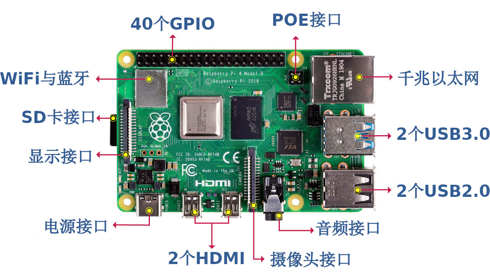

# :material-iron-board: 树莓派的硬件扩展

## :material-audio-input-rca: 树莓派 GPIO 接口简介 {#gpio-intro}

在嵌入式系统中，经常需要控制许多结构简单的外部设备或者电路，这些设备有的需要由 CPU 提供输出信号，有的需要向 CPU 提供输入信号，并且许多设备或电路只要求有开／关两种状态就可以满足使用需要，例如比如 LED 的亮与灭。对此类设备的控制，使用传统的串口或者并口就显得比较复杂。

在嵌入式微处理器上通常提供了一种“通用可编程 I/O 端口”，也就是 GPIO（General Purpose Input Output）。一个 GPIO 端口至少需要两个寄存器，一个做控制用的“通用 IO 端口控制寄存器”，还有一个是存放数据的“通用 I/O 端口数据寄存器”。数据寄存器的每一位是和 GPIO 的硬件引脚对应的，而数据的传递方向是通过控制寄存器设置的，通过控制寄存器可以设置每一位引脚的数据流向。

GPIO 是树莓派最强大的特点之一，它也是树莓派与外部世界交互的物理接口之一。如图 1.3 所示，树莓派型提供了 40 个 GPIO 引脚可用于对简单外设进行控制。树莓派 40 个 GPIO 引脚定义如图 2.1 所示。

<figure markdown="span">
  { width="300" }
  <figcaption>图 1.3：树莓派 4 代 B 型外观及接口配置</figcaption>
</figure>

## :material-developer-board: PIONEER600 树莓派扩展板简介 {#pioneer600-intro}

Pionner600 扩展板是一款 Raspberry Pi 的外围扩展板，带有丰富的板载资源，扩展了多种常用接口，提供了一些简易的 I/O 设备，例如 LED 指示灯、五向遥杆等。Pionner600 扩展板的外观与配置如图 2.2 所示。
