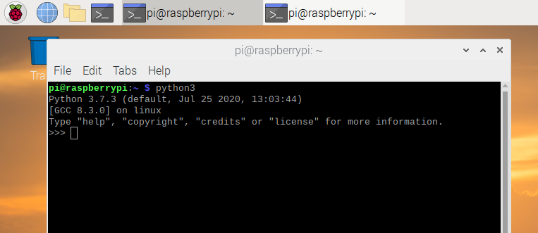
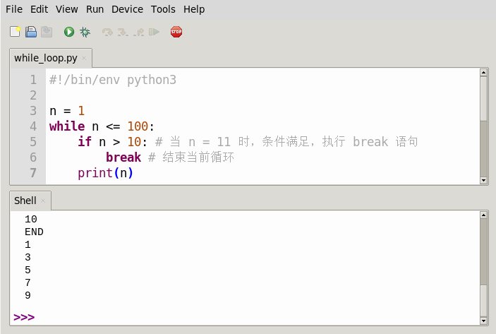

# :simple-python: Python 编程语言简介

[:fontawesome-brands-python: Python 语言](https://www.python.org/) 是一种面向对象的解释型计算机程序设计语言，由荷兰人 Guido van Rossum 于 1989 年发明，第一个公开发行版发行于 1991 年。Python 语言简单易学，代码简洁易懂，具有丰富和强大的库，封装了包括正则表达式、文档生成、单元测试、线程、数据库、网页浏览器、CGI、FTP、电子邮件、XML、XML-RPC、HTML、WAV 文件、密码系统、GUI（图形用户界面）和其他与系统有关的操作。Python 语言的主要缺点是相比于编译性语言其运行速度较 **慢**。

## :simple-micropython: Python 运行环境 {#python-env}

Python 是一种脚本语言，需要在解释器的帮助下运行。树莓派中安装了两个版本的 Python 解释器，分别是 `python2` 和 `python3`，代表了两个比较流行的版本。如果采用 `ssh` 的方式登录到树莓派，直接运行 `python` 或者 `python3` 就可以打开这两个解释器的交互环境。如果是采用 `VNC` 登录或者直接操作树莓派，需要首先打开一个模拟终端环境。树莓派自带的 [Thonny](https://thonny.org/) 或 [Geany](https://www.geany.org/) 也都是比较适合新手使用的集成开发工具。

如图 1.4，在菜单中选择附件中的 LX 终端或者直接单击提示栏中的有 `>_` 符号的图标就可以打开模拟终端，同样运行 `python` 即可。

<figure markdown="span">
  { width="300" }
  <figcaption>图 1.4：Python 运行环境</figcaption>
</figure>

在交互模式的提示符 `>>>` 下，直接输入代码，按回车，就可以立刻得到代码执行结果，例如：

```python linenums="1"
>>> 100+200
300
```

如果要让 Python 打印出指定的文字，可以用 `print()` 函数，然后把希望打印的文字用单引号或者双引号括起来。（`␣` 表示一个空格符号）

```python linenums="1"
>>> print("hello,␣world!")
hello, world!
```

在 Python 交互模式下输入 `exit()` 并回车（或者按 ++ctrl+d++），就退出了 Python 交互模式，并回到终端命令行。

Python 交互模式的代码是输入一行，执行一行。而命令行下直接运行。py 文件是一次性执行该文件内的所有代码。如：

```shell linenums="1"
$ python3 hello.py
Hello, world!
```

Python 交互模式主要是为了调试 Python 代码，也便于初学者学习。在 Python 的交互式命令行写程序，优点是立刻就能得到结果，缺点是没法保存。因此实际编程的时候通常是采用文本编辑器编写 Python 代码，编写完成后保存为一个文件，程序就可以反复执行了。Python 程序的源代码是纯文本文件，通过缩进来标识不同的语法层次关系，而“#”号后面的内容为注释，可用来对程序进行解释，提高代码的可读性。

## :octicons-number-16: 数据类型 {#data-type}

Python 语言支持的数据类型包括整数、浮点数、字符串、布尔值以及列表等。Python 可以处理任意大小的整数，当然包括负整数，在程序中的表示方法和数学上的写法一模一样，例如：`1`，`100`，`-8080`，`0` 等。计算机由于使用二进制，所以，有时候用十六进制表示整数比较方便，十六进制用 `0x` 前缀和 `0-9`，`a-f` 表示，例如：`0xff00`，`0xa5b4c3d2` 等。

浮点数可以用数学写法，如 `1.23`，`3.14`，`-9.01` 等。但是对于很大或很小的浮点数，就必须用科学计数法表示，把 `10` 用 `e` 替代，`1.23 × 109` 就是 `1.23e9`，或者 `12.3e8`，`0.000012` 可以写成 `1.2e-5` 等。

字符串是以单引号或双引号括起来的任意文本，比如 `'abc'`，`"xyz"` 等等。需要注意的是，单引号或双引号本身只是一种表示方式，不是字符串的一部分，因此，字符串 `'abc'` 只有 `a`，`b`，`c` 这 3 个字符。如果单引号本身也是一个字符，那就可以用双引括起来，比如 `"I’m OK"` 包含的字符是 `I`，`’`，`m`，`空格`，`O`，`K` 这 6 个字符。

布尔值和布尔代数的表示完全一致，一个布尔值只有 `True`、`False` 两种值，要么是 True，要么是 False，在 Python 中，**可以直接用 True、False 表示布尔值**。

## :octicons-x-12: 变量 {#variable}、

变量是指向各种类型值的名字。在 Python 中，变量的使用环境非常宽松，没有明显的变量声明，等号 `=` 是赋值语句，可以把任意数据类型赋值给变量。同一个变量可以反复赋值，而且可以是不同类型的变量。这种变量本身类型不固定的语言称之为动态语言，与之对应的是静态语言。静态语言在定义变量时必须指定变量类型，如果赋值的时候类型不匹配，就会报错。

在 Python 中，如果你不能确定变量或数据的类型，就用解释器内置的函数 `type` 确认。例如：

```python linenums="1"
>>> a = 'name'
type(a)
<class 'str'>
>>> classmates = ['Michael', 'Bob', 'Tracy']
>>> type(classmates)
<class 'list'>
```

## :material-code-array: 元组、列表、字典和集合 {#tuple-list-dict-set}

在程序设计的时候经常需要把多个元素包装到一起来使用，例如纸张的规格、训练的多组数据等。这种可以容纳多个变量的数据结构叫做容器，Python 有多个容器类别，分别适合不同的应用场景。

元组（tuple）是最简单的容器，所有元组元素使用括号包围，例如：

```python linenums="1"
BrickSize = (15, 23, 56)
Classmates = ('Bill', 'Carl')
```

元组一旦建立就不可以改变，里面的元素也可以是不同类型，常用的元组操作可以参考下面示例：

```python linenums="1"
len(BrickSize)	# 获取元组长度
print(Classmates[1]) # 通过索引获取元素（第一个元素的索引为 0 ）
BrickSize.index(15) # 查找元素的索引号
```

需要注意的是如果元组只有一个元素，那么定义的时候要在这个元素后面加上逗号，如 `a = (1,)`。

列表（list）是 Python 内置的另外一种容器类型，他和元组一样是一种有序的集合，但可以随时添加和删除其中的元素。列表中包含的元素可以具有相同的数据类型，也可以具有不同数据类型，例如：

```python linenums="1"
Names = ['Michael', 'Sarah', 'Tracy']
Objects = ['Apple', 123, True]
Sizes = [[10, 20], [15, 25], [20, 35]] # 列表当然也可以嵌套
```

列表在程序中经常使用，用法也十分灵活，下面是一些应用的例子：

```python linenums="1"
Names.append('Sarah') # 在末尾增加元素
Objects.insert(2, 456) # 在索引 2 的位置插入新元素
Objects.pop(2) # 删除索引 2 的元素（不加参数缺省删除末尾元素）
Sizes.reverse() # 元素顺序颠倒
Objects.clear() # 删除全部元素
Sizes.sort() # 对元素进行排序
Names.remove('Sarah') # 根据内容删除元素（只删除第一个匹配）
```

注意列表在复制的时候只是新建一个引用，所代表的内容是相同的，如果需要完整复制（深复制）一个列表元素，要用 `copy` 方法，例如：

```python linenums="1"
>>> Names = ['Michael', 'Sarah', 'Tracy']
>>> K=Names	# 浅复制
>>> Q=Names.copy()	# 深复制
>>> Names.append('Violet')# 修改原始变量的值
>>> K	# K 的值同时被改变
['Michael', 'Sarah', 'Tracy', 'Violet']
>>> Q	# Q 的值没有变化
['Michael', 'Sarah', 'Tracy']
```

和列表类似，字典（dict）也是可以保存多个元素的变量类型，其每个元素都是一个冒号分隔的键值对，例如：

```python linenums="1"
>>> dict = {'Alice': '1234', 'Bob': '5678', 'Charlie': '90'}
```

可以通过 “键” 对 “值” 进行查询，也可以对 “键” 进行赋值，例如：

```python linenums="1"
>>> dict.keys() # 返回全部的键列表 dict_keys(['Alice', 'Bob', 'Charlie'])
>>> dict.values() # 返回全部的值列表 dict_values(['1234', '5678', '90'])
>>> print(dict['Alice'])
1234
>>> dict['John']='45'	# 赋值的同时新建了一个键值对
```

字典也包含一些内置的函数，如 `clear()` 清除字典内容；`key in dict` 查询键是否存在；`len(dict)` 查询字典元素个数等。

集合（set）也与列表类似，但是不能存储重复的数据，并且是没有存放顺序的区别，集合可以通过 `add()` 增加元素，也可以通过 `remove()` 删除元素。比较特别的，集合可以求交集和并集，例如：

```python linenums="1"
>>> Names1 = {'Michael', 'Sarah', 'Tracy'}
>>> Names2 = {'Sarah', 'Violet', 'Alice'}
>>> Names1.intersection(Names2)	# 交集
{'Sarah'}
>>> Names1.union(Names2)	# 并集
{'Sarah', 'Alice', 'Tracy', 'Violet', 'Michael'}
>>> Names1.difference(Names2)	# 集合区别
{'Michael', 'Tracy'}
```

## :material-view-sequential: 序列的下标访问 {#index-access}

Python 中的字符串、元组和列表都是有序结构，都可以用下标进行访问，可以统称为序列。序列的下标访问主要有下面几种方式：

1. `seq[index]` 获得索引所在位置元素
2. `seq[index1:index2(:stride)]` 获得索引从 index1 到 index2 的全部元素，stride 是步长，缺省为 1， index1 空缺表示从头开始，index2 空缺表示到最后一个元素，`seq[:]` 表示全部元素。
3. `seq1 + seq2` 连接两个序列
4. `seq * expr` 序列元素重复 `expr` 遍当索引值为负时，它表示从序列最后一个元素开始计数，例如，`seq[-1]` 可以获得序列的最后一个元素。

## :material-invoice-export-outline: 基本输入输出 {#io}

在 Python 中，用 print() 函数在括号中加上字符串，就可以向屏幕上输出指定的文字。例如：

```python linenums="1"
>>> print('hello,␣world') hello, world
>>> name = 'Tom'
>>> print(name)
Tom
```

`print()` 函数也可以接受多个字符串，用逗号 “,” 隔开，就可以连成一串输出，print() 函数会依次打印每个字符串，遇到逗号“，”会输出一个空格，例如：

```python linenums="1"
>>> print('The␣brown␣fox', 'jumps␣over', 'the␣lazy␣dog.') The brown fox jumps over the lazy dog.
>>> print('100␣+␣200␣=', 100 + 200)
100 + 200 = 300
```

在 Python 中，可以利用 input() 函数完成基本输入。利用 input() 函数可以让用户输入字符串，并存放到指定的变量里。例如：

```python linenums="1"
>>> name = input()
Michael
```

当用户输入 name=input() 并按下回车后，Python 交互式命令行就在等待输入了，用户可以输入任意字符，然后按回车后完成输入。另外，可以在 input() 函数加入提示信息。例如：

```python linenums="1"
>>> name = input('please␣enter␣your␣name:␣') please enter your name: Michael >>> print('hello,', name) hello, Michael
```

## :material-image-filter-center-focus-strong: 条件判断 {#condition}

在 Python 程序中，用 if 语句实现条件判断。例如：

```python linenums="1"
total = query() # 查询库存 if total == 0:
print('Out␣of␣stock') order(100)
```

根据 Python 的缩进规则，如果 if 语句判断是 True，就执行缩进的两行语执行，否则，什么也不做。也可以给 if 语句添加一个 else 语句，如果 if 判断是 False，不执行 if 后的语句，而是执行 else 后的语句。需要注意的是 if 语句和 else 语句后面要添加冒号。例如：

```python linenums="1"
food = input('What␣do␣you␣like␣to␣eat?␣') if food == 'Apple':
print('Please␣enjoy')
else:
print("Sorry,␣We␣don't␣have␣any")
```

另外，可利用 elif 语句添加多个条件判断，elif 是 elseif 的缩写，可以有多个 elif 语句。例如：

```python linenums="1"
age = int(input('Enter␣your␣age:␣')) if age >= 18:
print('You␣are␣an␣adult!') elif age >= 6:
print('You␣are␣a␣teenager')
else:
print('You␣are␣a␣kid')
```

## :octicons-circle-16: 循环 {#loop}

Python 的循环有两种，一种是 for...in 循环，另一种是 while 循环。for...in 循环可以依次将列表中的每个元素迭代出来。例如：

```python linenums="1"
for i in [0,1, 2, 3, 4, 5, 6, 7, 8, 9]:
print(i)
```

可以利用 Python 提供的 range() 函数控制 for 循环，range() 函数可以产生一个整数序列。上面利用 for 循环的求和代码可用 range() 函数进行简化。

```python linenums="1"
for i in range(0,10): # 从 0 循环至 9
print(i)
```

另外，range() 函数产生的整数序列可以指定步进值，例如：

```python linenums="1"
for i in range(0,10,2): # 从 0 循环至 9，步进值为 2
print(i)
```

Python 的 while 循环只要条件满足就不断循环，条件不满足时退出循环。例如：

```python linenums="1"
n = 1 while n <= 100:
print(n)
n = n + 1
```

对于循环语句，可以通过 break 语句退出循环或通过 continue 语句跳过当前循环。例如：

```python linenums="1"
n = 1 while n <= 100:
if n > 10: # 当 n = 11 时，条件满足，执行 break 语句 break # 结束当前循环
print(n)
n = n + 1
print('END')
n = 0 while n < 10 : n = n + 1 if n % 2 == 0 : # 如果 n 是偶数，执行 continue 语句 continue # 跳过当前循环
print (n)
```

## :material-file-code: Python 的文件操作 {#file-op}

在操作文件之前，需要先把文件打开，操作之后还需要把文件关闭，与这两个操作对应的函数是 open 和 close。open 操作返回一个文件类，后续对这个文件的操作都通过这个类来进行。open 函数的定义如下：

```python linenums="1"
open(name[, mode[, buffering]])
```

其中 name 参数为文件的名称，mode 为文件的打开方式，buffering 表示缓冲区的大小。最常用的 mode 参数为”r” 和”w”，分别代表读和写的方式，当用”w” 的方式打开时，如果文件已经存在，则里面的内容会被清空。还有一种”a” 方式用来在文件后面添加新的内容。另外”r+”、”w+” 和”a+” 都以读写方式打开文件，但”w+” 会清空文件，”a+” 会将文件指针放到文件末尾。

文件操作包括文件的读和写，对于文本文件，可以认为其内容是一个字符串数组，每个字符串代表文件的一行，这样就可以利用下面的示例代码将整个文件读入。

```python linenums="1"
f = open(filename , 'r')
lines = f.readlines()
f.close()
```

文件主要使用 write 函数将数据写入，简单示例如下：

```python linenums="1"
f = open(filename, 'a')
f.write('Last␣line\n')
f.close()
```

## :simple-pipx: Python 库 {#python-lib}

Python 语言可以通过库来进行扩展，实现一些在特定领域比较常见的算法，供所有软件开发人员来使用，大大提高了 Python 语言的开发效率。本书后续介绍的人工智能算法很多都有相应的库来支持，复杂的运行过程可以通过简单几个 Python 语句来实现，降低了人工智能的应用门槛，这也使得 Python 成为人工智能开发中最常用的编程语言。

在 Python 的发行版中还包含了大量的标准库，可以在不额外安装软件的前提下使用。例如文件系统的操作、常用数据类型、常用算法等等。例如 random 库实现了常用随机数的产生，random() 函数在 [0,1) 区间生成均匀分布的随机浮点数。randint(a,b) 函数返回在 [a,b] 区间的均匀分布整数。例如，下面代码生成了十个随机整数。

```python linenums="1"
import random # 导 入 random 模 块
data = [] # 定 义 一 个 空 的 列 表 data
for i in range(0,10):
data.append(random.randint(0,99))
```

Python 标准库的资料可以参考 [官方的在线文档](https://docs.python.org/zh-cn/3/library/)，了解标准库所包含的内容并在程序中进行运用可以简化代码设计，保证代码的质量。

## :material-bug: Python 程序的编写和调试 {#debug}

对于新手来说，直接使用 Vim 编辑源代码来开发 Python 程序确实有些难度，树莓派操作系统中安装的 Thonny 则是一个更好的选择。它是一个简单的 Python 集成开发环境，支持语法高亮、代码补全、单步调试等功能，可以方便的编写 Python 代码。图 1.5 是 Thonny 的运行界面，上半部分是编辑的程序代码，下半部分是程序的运行结果。

点击工具栏上的调试按钮或者在 Run 菜单中选择 Debug 命令就可以对程序进行单步调试。单步调试时可以选择 Step Over（快捷键 F6）一次执行一条语句，对于函数和类方法等可以一次跳过；也可以选择 Step Into（快捷键 F7）在遇到函数和类方法时可以进入模块内部单步执行。Step Out（快捷键 F8）是跳出当前模块，表示进入到函数和类方法时执行到这个模块的末尾，跳到上一层级的代码。

在编写程序时熟练使用调试功能可以帮助新手快速熟悉语言功能，找出程序中存在的 bug，加深对
Python 程序运行过程的理解。

<figure markdown="span">
  { width="300" }
  <figcaption>图 1.5：Thonny 的运行界面</figcaption>
</figure>