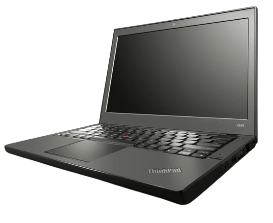
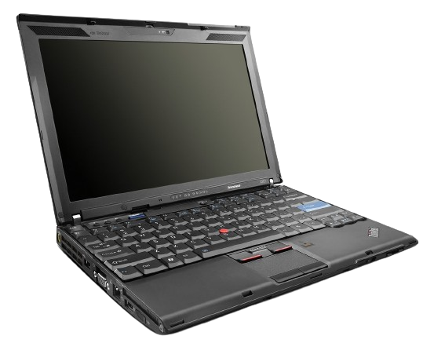
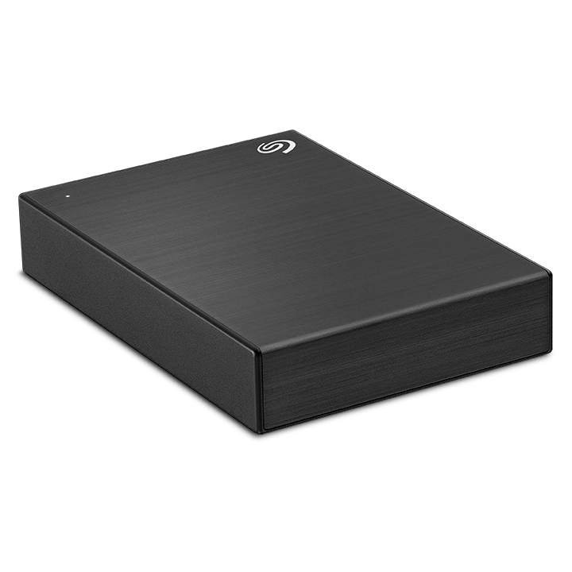
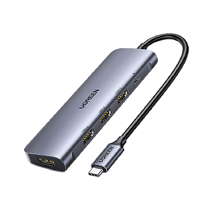
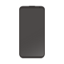
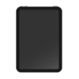
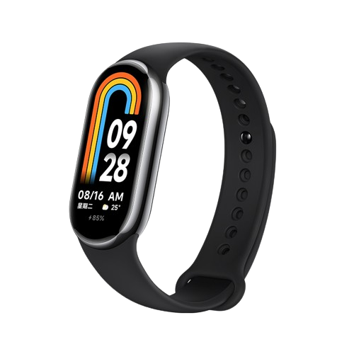

# :material-devices: 我的装备

## :octicons-device-desktop-16: 电脑

-   :simple-hp:{ .lg .middle } **惠普暗影精灵 9**

    ---

    { align=left width="360" height="360" }

    - [x] 大名鼎鼎的 **黑屏精灵** :slight_smile: :neutral_face: :upside_down:

    - [x] **伪装成台式机的游戏本，目前的主力机器。**

    - [x] Win 11 + Ubuntu + Arch 三系统

    - [x] 性能强悍，风扇狂转，发热严重

    - [x] i9-13900HX + RTX 4060

    - [x] 32GB RAM / 1TB + 2TB SSD
    
    - [x] 开发，娱乐，办公一把梭

-   :fontawesome-brands-apple:{ .lg .middle } **MacBook Pro 2020**

    ---

    { align=left width="360" height="360" }
    
    - [x] 最后一代 Intel 芯片的 MBP :cry:
    
    - [x] 四核 Intel Core i5 + Intel 集显
    
    - [x] 16GB RAM / 512GB SSD
    
    - [x] 发热有些严重，续航一般
    
    - [x] 屏幕，键盘，触控板体验一流
    
    - [x] 轻便易携，日常开发完全够用

-   :simple-thinkpad:{ .lg .middle } **ThinkPad L480**

    ---

    { align=left width="333" height="333" }
    
    - [x] 7 年前发售的经典商务本，开机依然耐用，做工依然耐操，外观依然耐看，性能依然稳定
    
    - [x] Thinkpad + Win 10 + Arch 双系统 === 生产力利器 + 背包必备
    
    - [x] 机身触感好，键盘手感佳，小红点很方便
    
    - [x] 8GB RAM / 256GB + 1TB SSD
    
    - [x] i7-8550U + Radeon 530

-   :simple-thinkpad:{ .lg .middle } **Thinkpad X240**

    ---

    { align=left width="288" height="288" }
    
    - [x] 11 年前发售的“轻薄便携”本，配置在今天看来很丐，但配上 SSD + Arch Linux 依然流畅
    
    - [x] Thinkpad 的做工还是相当好的，轻量使用还是很舒服的
    
    - [x] 目前拿来当作测试机，以后可能会拿来跑些轻量服务
    
    - [x] 双核 Intel Core i3-4010U + Intel 集显
    
    - [x] 8GB RAM / 128GB + 320GB SSD

-   :simple-thinkpad:{ .lg .middle } **Thinkpad X201**

    ---

    { align=left width="300" height="300" }
    
    - [x] 上古时代的笔记本电脑，配置已是丐中丐，Win 7 / Arch Linux 还不至于卡顿
    
    - [x] Celeron U3400 + Intel 集显
    
    - [x] 4GB RAM / 128GB SSD
    
    - [x] 目前有如下处理方案：
    
        - [x] 改造成小型 NAS 使用
    
        - [x] 装上 Linux / BSD，做服务器使用

-   :simple-hp:{ .lg .middle } **惠普暗影精灵 2**

    ---

    { align=left width="360" height="360" }
    
    - [x] 基本介绍
    
    - [x] CPU + GPU
    
    - [x] GB RAM / GB SSD
    
    - [x] 使用概况
    
    - [x] 屏幕，键盘等个性化体验
    
    - [x] 目前主要用途

-   :material-laptop:{ .lg .middle } **机械革命笔记本**

    ---

    { align=left width="360" height="360" }
    
    - [x] 基本介绍
    
    - [x] CPU + GPU
    
    - [x] GB RAM / GB SSD
    
    - [x] 使用概况
    
    - [x] 屏幕，键盘等个性化体验
    
    - [x] 目前主要用途

## :material-monitor-cellphone: 外设

-   :simple-lenovo:{ .lg .middle } **Lenovo 27 英寸 显示器**

    ---

    { align=left width="360" height="360" }
    
    - [x] 宿舍桌面上刚好能放下 27 英寸的显示器
    
    - [x] 2K 分辨率，120Hz 刷新率，不可升降旋转
    
    - [x] 目前横向放置，充当 HP 暗影精灵 9 的主扩展屏幕
    
    - [x] RTX 4060 Laptop 能带动 2K 显示器，效果还不错
    
    - [x] 大屏在分屏，观影，游戏时优势明显 :smiling_face_with_3_hearts:

-   :material-monitor-screenshot:{ .lg .middle } **AOC 21.5 英寸 显示器**

    ---

    { align=left width="360" height="360" }
    
    - [x] 1080P 分辨率，75Hz 刷新率，可升降旋转
    
    - [x] 宿舍桌面侧边放置，空间有些紧张
    
    - [x] 目前竖向放置，充当 HP 暗影精灵 9 的第二扩展屏幕
    
    - [x] 1080P + Windows 糟糕的字体渲染其实对长期伏案者不太友好，不过用来看看文档和代码也够了

-   :simple-seagate:{ .lg .middle } **希捷移动硬盘 5TB**

    ---

    { align=left width="234" height="234" }
    
    - [x] 赛博仓鼠必备（有 NAS 的当我没说）
    
    - [x] 机械硬盘，传输速度一般，但容量大，价格便宜
    
    - [x] 主要用途：
    
        - [x] 备份，存储一些大文件；
    
        - [x] 构建自己的影视音乐库；
    
        - [x] PT 做种。

-   :material-hand-extended:{ .lg .middle } **拓展坞 x2**

    ---

    { align=left width="200" height="200" }
    
    - [x] 
    
    - [x] 
    
    - [x] 
    
    - [x] 
    
    - [x] 
    
    - [x] 

-   :keyboard:{ .lg .middle } **机械键盘 x3**

    ---

    { align=left width="360" height="360" }
    
    - [x] 
    
    - [x] 
    
    - [x] 
    
    - [x] 
    
    - [x] 
    
    - [x] 

-   :simple-bluetooth:{ .lg .middle } **蓝牙耳机**

    ---

    { align=left width="360" height="360" }
    
    - [x] 
    
    - [x] 
    
    - [x] 
    
    - [x] 
    
    - [x] 
    
    - [x] 

-   :mouse_three_button:{ .lg .middle } **鼠标 x2**

    ---

    { align=left width="360" height="360" }
    
    - [x] 
    
    - [x] 
    
    - [x] 
    
    - [x] 
    
    - [x] 
    
    - [x] 

## :octicons-device-mobile-16: 移动设备

-   :simple-xiaomi:{ .lg .middle } **小米 13**

    ---

    { align=left width="300" height="300" }
    
    - [x] 人生的第一台智能手机，高考后购入
    
    - [x] 小屏旗舰，握感良好，性能不错
    
    - [x] 骁龙 8 Gen 2 芯片，23年安卓顶配？
    
    - [x] 许多功能是 IOS 没有的，或许是因为我用惯了 MIUI 的原因吧 :thinking:
    
    - [x] 12GB RAM / 256GB ROM，内存够用，存储勉强够用（512GB 还是靠谱些哈哈哈）
    
    - [x] 玩游戏时略微发热，总体续航不错

-   :fontawesome-brands-apple:{ .lg .middle } **iPad Air 5**

    ---

    { align=left width="324" height="324" }
    
    - [x] 
    
    - [x] 
    
    - [x] 
    
    - [x] 
    
    - [x] 
    
    - [x] 

-   :simple-xiaomi:{ .lg .middle } **小米手环 8**

    ---

    { align=left width="234" height="234" }
    
    - [x] 
    
    - [x] 
    
    - [x] 
    
    - [x] 
    
    - [x] 
    
    - [x] 

## :simple-tripadvisor: 出行

-   :material-bag-personal-tag:{ .lg .middle } **皮包**

    ---

    { align=left width="360" height="360" }
    
    - [x] 
    
    - [x] 
    
    - [x] 
    
    - [x] 
    
    - [x] 
    
    - [x] 

-   :baggage_claim:{ .lg .middle } **Adidas 背包**

    ---

    { align=left width="360" height="360" }
    
    - [x] 从高中开始陪伴我的背包，如今依然轻便耐用
    
    - [x] 
    
    - [x] 
    
    - [x] 
    
    - [x] 
    
    - [x] 

-   :material-bag-personal:{ .lg .middle } **魅族背包**

    ---

    { align=left width="360" height="360" }
    
    - [x] 朋友送的，容量大，质量好
    
    - [x] 
    
    - [x] 
    
    - [x] 
    
    - [x] 
    
    - [x] 

-   :fontawesome-solid-suitcase-rolling:{ .lg .middle } **大号行李箱**

    ---

    { align=left width="360" height="360" }
    
    - [x] 
    
    - [x] 
    
    - [x] 
    
    - [x] 
    
    - [x] 
    
    - [x] 

-   :material-bag-suitcase:{ .lg .middle } **小号行李箱**

    ---

    { align=left width="360" height="360" }
    
    - [x] 
    
    - [x] 
    
    - [x] 
    
    - [x] 
    
    - [x] 
    
    - [x] 

