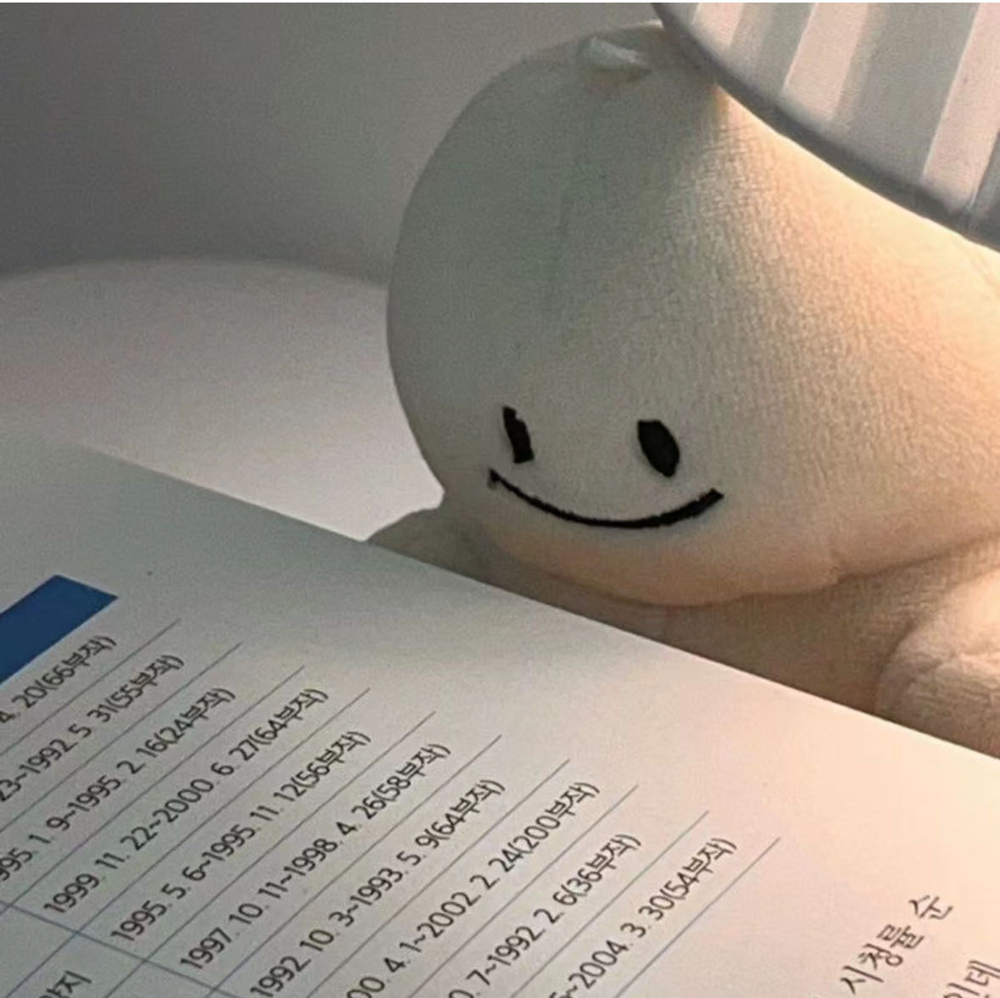
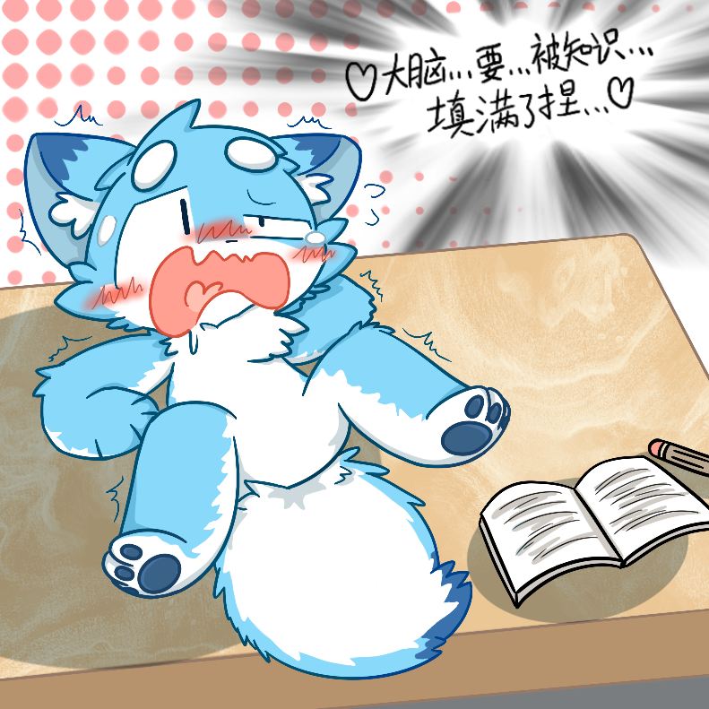

# :material-link-plus: 友链

!!! Note
    朋友们的博客，欢迎大佬们互换友链！

    <a href="https://cine-philia.github.io/" title="Cine Philia" target="_blank">
        

            
        

        
Cine Philia

        
迷影至上！

    </a>

    <a href="http://8.130.104.118:8090/" title="zyzx" target="_blank">
        

            
        

        
zyzx

        
医学生的博客

    </a>

    <a href="https://earendelh.github.io/" title="埃伦德尔" target="_blank">
        

            
        

        
埃伦德尔

        
寄系帕鲁日记

    </a>

    <a href="https://woyo-i-sllh.github.io/" title="WOYO-I-SLLH" target="_blank">
        

            
        

        
WOYO-I-SLLH

        
阿巴阿巴阿巴

    </a>

    <a href="https://xiaodengwang01.github.io/" title="小登王" target="_blank">
        

            
        

        
小登王

        
Xiaodengwang's Blog

    </a>

