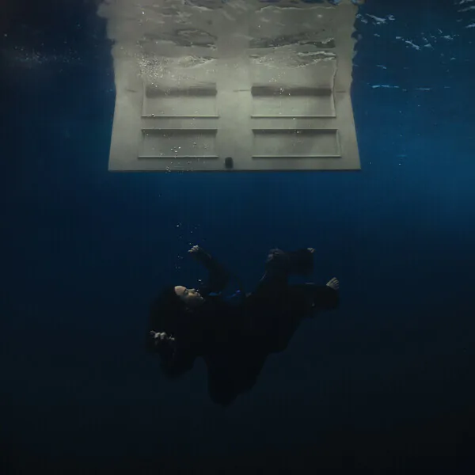

# :material-link-plus: 友链

!!! Note
    朋友们的博客，欢迎大佬们互换友链！

    <a href="https://cine-philia.github.io/" title="Cine Philia" target="_blank">
        

            
        

        
Cine Philia

        
迷影至上！

    </a>

    <a href="http://8.130.104.118:8090/" title="zyzx" target="_blank">
        

            
        

        
zyzx

        
医学生的博客

    </a>

    <a href="https://lightyourjourney.github.io/" title="Yanjin Li" target="_blank">
        

            
        

        
Yanjin Li

        
半成品 💀

    </a>

