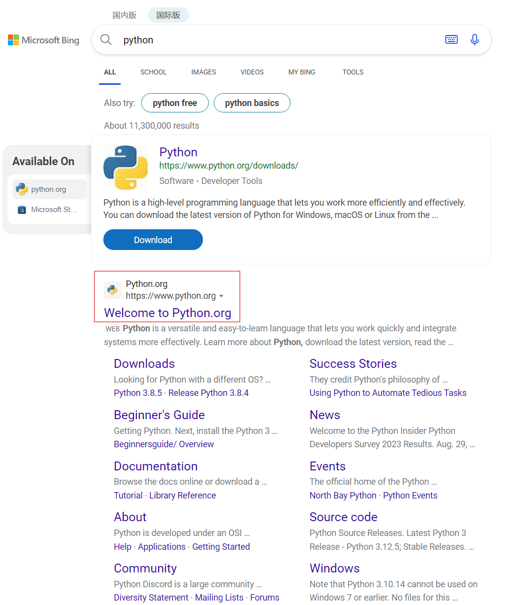
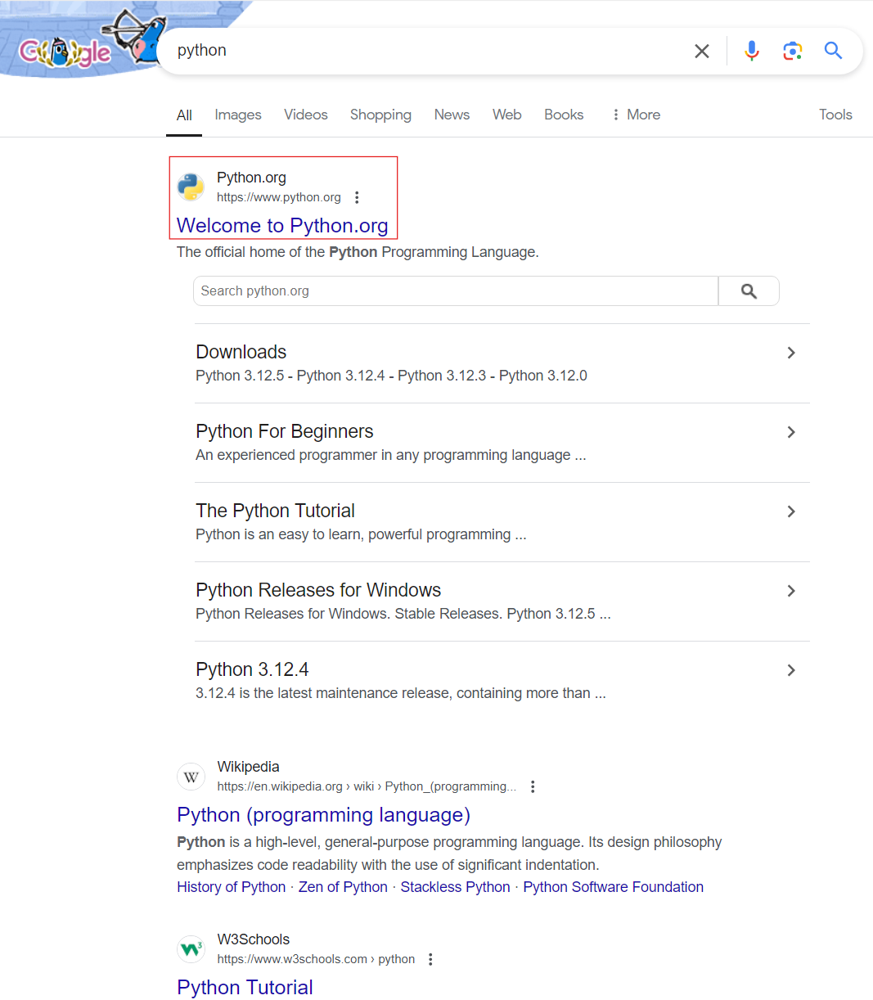
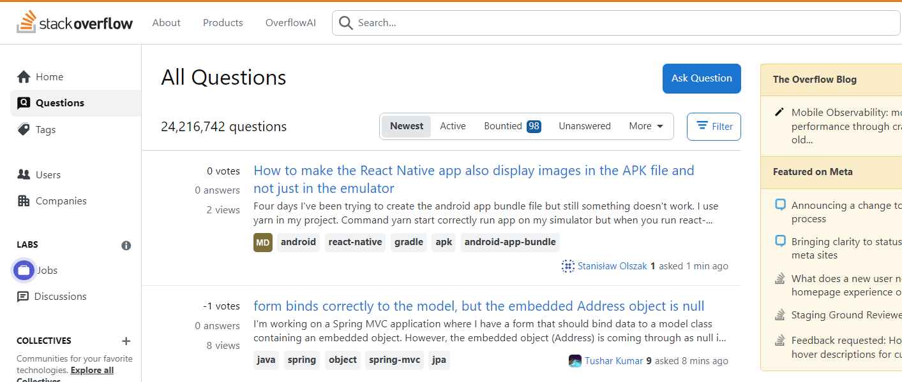

# :material-google: 搜索和知识获取

## :material-marker: 记号与约定 {#notation}

在本文中，所有的提示、练习及补充资料均以这样的形式出现：

!!! example "示例"
    你来的真早！
    
    在本文的写作中，笔者参考了许多网络上已公开的文章，均以补充资料的形式标注，在此向它们的作者表示由衷的感谢。
    
    那就从这里开始你的 Getting Started 之旅吧！

## :simple-knowledgebase: 知识的获取 {#how-to-know}

### :material-microsoft-bing: 搜索引擎的选取 {#search-engine}

你得知大一开学的计算概论课上需要用到 Python 语言，于是你决定提前学习一下。你兴致勃勃地打开了浏览器，打开了熟悉的“度娘”，输入了 `Python`，然后点击了搜索。结果呢？

<figure markdown="span">
  
  <figcaption>百度搜索结果</figcaption>
</figure>

搜索页面充斥着各种打着“正版网站”旗号的广告，官方网站甚至没能挤进首页！这显然不是我们想要的结果。

**一个好的搜索引擎往往能提升你的查询效率**。所以，相较于百度（或是更为小众的 360 搜索和搜狗搜索），笔者更推荐你使用 [微软 Bing 搜索](https://www.bing.com) 和 [Google 搜索](https://www.google.com)。

对于 Bing 搜索，你应该能够在页面顶端发现 **国内版** 以及 **国际版** 的选项。经过笔者测试，在使用国内版进行搜索时，仍然会出现少量的广告（国内：发自我的百度），**但官方网站通常能够出现在首页**。而在使用国际版进行搜索时，**广告会更少，搜索结果也更为准确**。

所以，如果你想要得到更好的搜索结果，同时你要搜索的信息 **非中文社区独有**，在这两个版本当中笔者更建议你使用后者。

<figure markdown="span">
  
  <figcaption>微软 Bing 搜索国内版结果</figcaption>
</figure>

<figure markdown="span">
  
  <figcaption>微软 Bing 搜索国际版结果</figcaption>
</figure>

!!! info "对比参考"
    细心的你也许会发现，在使用 Bing 搜索时，地址栏上的网址并不是以 [`www.bing.com`](https://www.bing.com/) 开头，而是 [`cn.bing.com`](https://cn.bing.com/)。而如果你能够访问 [`www.bing.com`](https://www.bing.com/)，得到的结果大概是这样的：

    <figure markdown="span">
      
      <figcaption>微软 Bing 搜索海外版结果</figcaption>
    </figure>

    没有广告，官方网站直接出现在了首位，我们得到了非常不错的搜索结果！

而对于 Google 搜索，如你所见，作为全球最大的搜索引擎，其搜索结果往往较为准确，直接且全面。

简言之，在条件允许的情况下，笔者推荐你优先使用 Google 搜索，其次是 Bing 搜索的国际版和国内版。

<figure markdown="span">
  
  <figcaption>Google 搜索结果</figcaption>
</figure>

!!! info "仅供参考"
    要更方便地使用 Google 搜索以及真正的 Bing 搜索，你也许可以在 [CS 自学指南](https://csdiy.wiki/) 的 [**必学工具**](https://csdiy.wiki/%E5%BF%85%E5%AD%A6%E5%B7%A5%E5%85%B7/%E7%BF%BB%E5%A2%99/) 中找到一些更为优雅的方式。

### :octicons-question-16: 如何搜索？ {#how-to-search}

#### :material-key-link: 关键词组合 {#keywords}

在搜索时，你需要使用 **关键词** 进行组合来描述你的问题。关键词是搜索引擎用来匹配你的搜索内容的重要依据，它能够帮助你更快地找到你需要的信息。**尽可能避免使用完整句子进行搜索**，因为其往往可能包含多余的信息，导致搜索结果不够精确。此外，关键词搜索也可以更好地利用搜索引擎的算法优化网页。

!!! example "举个例子！"
    比如你想解决“我最近一直睡不好，想知道有哪些方法可以帮助我改善睡眠质量，让我每晚都能有更好的休息”。这时候，你可以尝试使用关键词 `改善睡眠 方法 快速` 的组合，也许会搜索到更有效的信息。

#### :material-file-word-box: 英文关键词 {#english-keywords}

英文作为国际通用语言，使用英文关键词搜索能获取来自 **全球范围内的最新信息**，而不仅仅局限于中文社区。尤其在技术、科学等领域，技术文档、编程教程、软件说明等都是以英文撰写，相关领域的最新研究和资料，也通常首先以英文发布。

即便你的英文水平没那么好，你也可以通过翻译工具将你的问题翻译成英文，然后再进行搜索，进而获得更丰富、更全面的搜索结果。

!!! tip "小贴士！"
    事实上，上面两条建议在绝大多数情况下都已经完全足够了。但若有需要，也可以尝试使用一些 **高级搜索选项**。比如在搜索框中输入 `site:python.org`，这样你就可以只搜索 Python 官方网站上的内容了。
    
    如果你对更多的高级搜索选项感兴趣，可以使用前文提到的两条建议查找相关资料。

> !!! question "试一试！"
>
>     The Book 几乎是学习 Rust 语言的必读书目。你能尝试找到其英文原版的官方网站主页地址吗？

### :octicons-info-16: 信息平台 {#information-platform}

#### :material-file-document: 官方文档 {#official-doc}

如果你想要获取关于一个软件或者一门编程语言的信息，最好的资料往往是它的 **官方文档**。官方文档通常包含了该软件或者编程语言的所有信息，包括使用方法、函数说明、示例代码等等。官方文档通常是最权威、最全面的，是你学习一个新技术的最佳选择。

一般而言，你可以在相应技术的官网上找到官方文档的入口。比如 Python 的官方文档就可以在 [Python 官网](https://www.python.org/) 上找到。

<figure markdown="span">
  
  <figcaption>Python 官方文档</figcaption>
</figure>

!!! tip "小贴士！"
    有一个古老而神圣的传统：如果你收到了类似 `RTFM`（Read The F\*\*king Manual）的回应，回答者认为你应该去搜索官方文档或使用手册。当然，**大概率他是对的，你应该去读一读**。

    同样道理的还有 `STFW`（Search The F\*\*king Web）和 `RTFSC`（Read The F\*\*king Source Code）。

    通常，用这几句话之一回答你的人会给你一份包含你需要内容的手册或者一个网址，这意味着你需要的信息非常容易获得。而往往你自己去搜索这些信息比直接告诉你答案，能让你学到更多。

> !!! question "试一试！"
>
>     $\LaTeX$ 是在论文写作中最常用的排版工具。你能尝试找到其官方文档的地址吗？

> !!! question "试一试！"
>
>     本 Wiki 由 VitePress 强力驱动，你能尝试在其官方文档中找到如何修改右侧的目录栏吗？

#### :material-stack-overflow: Stack Overflow {#stack-overflow}

<figure markdown="span">
  
  <figcaption>StackOverflow 官网首页</figcaption>
</figure>

[**Stack Overflow**](https://stackoverflow.com/)（意为 “堆栈溢出”） 是一个面向 **计算机程序员** 的问答网站。截至 2024 年 3 月，Stack Overflow 已收到了超过 2400 万个问题和 3500 万个答案。该网站和类似的编程问答网站在 2000 年代在全球范围内主要取代了编程书籍，作为日常编程参考，成为计算机编程的重要组成部分。

你可以在 Stack Overflow 上搜索到大量的问题和答案，这往往是程序员们在工作或学习中遇到的问题，相信能对你的技术学习之旅有所帮助。

#### :simple-github: GitHub {#github}

<figure markdown="span">
  
  <figcaption>GitHub 官网首页</figcaption>
</figure>

[**GitHub**](https://github.com/) 是一个在线软件源代码托管服务平台，允许开发人员创建、存储、管理和共享他们的代码。它使用 [Git](https://git-scm.com/) 软件，为每个项目提供 Git 的分布式版本控制以及访问控制、错误跟踪、软件功能请求、任务管理、持续集成和 Wiki。

你可以在 GitHub 上找到许多优秀的开源项目。一般而言，进入一个项目主页后，你可以通过查看 `README.md` 文件来快速上手如何构建或使用一个项目，同时也许可以在该文件中找到项目对应的官方文档地址和下载地址；你也可以在右侧的 `Releases` 选项中找到不同版本的安装包。当然，你也可以通过访问这些项目的 `Issues` 页面来查看其他人提出的有关该项目的问题和解答，这对你解决使用过程中遇到的问题非常有帮助。

!!! tip "小贴士！"
    如果你对 Git 感兴趣，可以提前阅读入门篇的 [第五章](./use/git.md)。

#### :simple-zhihu: [知乎](https://www.zhihu.com/) / [博客园](https://www.cnblogs.com/) / [简书](https://www.jianshu.com/) / [Bilibili](https://www.bilibili.com/) {#chinese-forums}

这是一些国内的问答社区、博客和视频平台。在这些平台上，你可以找到许多关于技术、编程、学习、生活等方面的问题和答案。当然，**时间距现在越近，获得的点赞或收藏数越多** 的回答或视频往往更为准确、全面。

#### :simple-wikipedia: Wikipedia {#wikipedia}

<figure markdown="span">
  
  <figcaption>Wikipedia 官网首页</figcaption>
</figure>

相较于百度百科，[**Wikipedia**](https://www.wikipedia.org/) 是一个更为全面、更为权威的网络百科全书，早已成为全球网络上最大且最受大众欢迎的参考工具书。你几乎可以在 Wikipedia 上找到关于任何事物的信息，包括历史、科学、技术、文化等等。

维基百科在性质上一如其号称般属于可自由访问和编辑的全球知识体，这也意味着除传统百科全书所收录的信息外，维基百科也能够收录 **非学术但仍具有一定媒体关注度的动态事件**，这使得许多人也渐渐将维基百科视为新闻来源。同时，为方便一般学生或者浏览群众能够简单了解条目的内容，维基百科中的绝大多数条目都尽可能以简单的话语来解释复杂的概念。

当然，值得注意的是，这类百科类的信息平台往往允许较多用户编辑，破坏者能够轻易部分条目中添加虚假内容、删除正确信息或者任意添加偏见性内容。同时，不同语言版本的内容可能会有较大差异，质量也可能天差地别。你可以在阅读维基百科时 **参考多个语言版本的内容**，以获得更全面的信息。

另外，你可能需要一些前文提到过的比较优雅的方式才能访问到这个网站。

#### :simple-w3schools: W3Schools {#w3schools}

<figure markdown="span">
  
  <figcaption>W3Schools 官网首页</figcaption>
</figure>

[**W3Schools**](https://www.w3schools.com/) 提供了许多关于开发和编程语言的教程。这些教程涵盖了 `HTML`、`CSS`、`JavaScript`、`SQL`、`Python`、`Java`、`PHP`、`C`、`C++`、`C#`、`Bootstrap`、`React`、`jQuery`、`XML` 和 `EXCEL` 等多个方面。W3Schools 官网上免费提供原始代码示例及说明，其中大部分示例还可以在即时编辑器中进行交互式编辑与执行，非常适合初学者上手体验。

如果读起来有些费力，没关系！国内也有类似的平台在做着相同的事情。比如 [菜鸟教程](https://www.runoob.com/)，[W3School](https://www.w3school.com.cn/) 等，只是内容丰富度上相比 W3Schools 稍显逊色。

#### :simple-wikidotjs: [OI Wiki](https://oi-wiki.org/) / [CTF Wiki](https://ctf-wiki.org/) / [HPC Wiki](https://hpcwiki.io/) {#oi-ctf-hpc-wiki}

学校每年都会举行 [PKU Campus](http://poj.openjudge.cn/)、[GeekGame](https://geekgame.pku.edu.cn/) 和 [HPC Game](https://hpcgame.pku.edu.cn/) 等比赛，这些比赛往往会涉及到算法、数据结构、网络安全、操作系统、并行与分布式计算等多个领域。在这些比赛中，上述三个 Wiki 都是非常好的参考资料。

如果你正在被计概和数算课程困扰，或是对算法、CTF 或是 HPC 领域感兴趣，不妨来看看！这些 Wiki 几乎都由在相关领域耕耘多年的现役/退役选手撰写，也许比授课老师们的 PPT 更有趣，也更容易理解。

#### :simple-internetcomputer: CS 自学指南 {#cs-diy}

这是一本计算机专业相关知识的[**自学指南**](https://csdiy.wiki/)，包含了计算机科学、编程、网络安全、操作系统、数据库、分布式系统、机器学习等多个领域的优质课程推荐及资源指南。如果你觉得老师讲的不合你胃口，或是想要在课程之外更深入地学习某个领域，不妨来看看这本指南。

---

上文介绍了多个较为靠谱的问答平台与知识整合平台，但也只是冰山一角。值得注意的是，从各种平台获取的信息 **不应盲目相信**。首先，这些信息未必准确，有的文章或问答可能已有十年之久，早已过时。其次，即使这些信息在当时是正确的，也仅仅解决了当时的特定问题，不一定完全适用于当前你所处的情境。

最直接也最简单的鉴别信息可靠性的方法是 **亲自实践**。多尝试是快速解决问题的重要方法之一。如果无法进行尝试，则尽可能信任官方平台发布的信息。

!!! tip "小贴士！"
    特别的，此处笔者并没有列举知名平台 [CSDN](https://blog.csdn.net/)，这并不代表 CSDN 上没有好的文章，事实上笔者也有少部分问题最终在该平台上找到答案。但正如前文所述，**高质量的平台能够节约你鉴别信息的精力**。在笔者个人的使用体验中，在 CSDN 的铺天盖地的广告与付费低质量文章的夹缝中寻找答案，是一件相当痛苦的事情。

## :simple-askfm: 提问的智慧 {#wisdom-of-ask}

“我所能收集到的信息都试过了，都没法解决问题，走投无路了，怎么办？”

这时候，你可以考虑大胆提问了！

### :material-forum: 在哪里提问？ {#where-to-ask}

除了向你熟悉的大佬“抱大腿”，你还可以尝试以下几种方式：

#### :material-forum-outline: 在前文提到的论坛或问答网站上发表帖子或提问 {#forum}

这是一个很传统也很有效的提问方式。你可以得到来自不同人的回答，这样你就有概率能够得到更多的帮助。当然，收集到的信息也相对良莠不齐，信息的价值需要自行甄别。同时，你的贴子和问答也会被其他人看到，一定程度上也可造福后人。

#### :octicons-issue-tracks-16: 在 GitHub 上发 Issue {#github-issue}

如果你在使用一个开源项目时遇到了问题，你可以尝试在该项目的 GitHub 仓库中发 Issue。这样，项目的维护者或是其他用户就能够看到你的问题，并给出可能的解决方法。事实上有时这可能并不是你的问题，而是项目本身出现了小小的漏洞。当然，这也一定程度上能够帮助到以后遇到相同问题的用户。

#### :simple-homeassistantcommunitystore: 尝试在社群中提问 {#community}

尝试加入一些技术社群，大胆提问，和社群中的人积极交流，也许你就能够得到解答，并增长见识。社群中的部分活跃成员往往有着丰富的经验，他们也许能够帮助你解决问题，或是给出更好的解决方案。

如果你还没有加入任何技术社群，欢迎加入 **北京大学学生 Linux 俱乐部**！我们拥有着活跃的微信社群与 QQ 社群，且有相当一部分热心的成员解答群内的问题。如果你是校内同学，请邮件联系 [linuxclub@pku.edu.cn](mailto:linuxclub@pku.edu.cn)，在确定你符合要求后，我们会将你拉入微信社群。如果你是校外同学，也欢迎加入我们的 [QQ 社群](https://qm.qq.com/q/LrcHgbpfqi)。

#### :llama: 不妨问问看起来比你懂得多一些的 LLM？ {#llm}

稍安勿躁，[后文](#llm-ask)会较为详细地介绍这一部分。

### :material-frequently-asked-questions: 如何提问？ {#how-to-ask}

提问是一项非常重要的技能，既要让其他人能够快速了解你的现状与需求，又能让别人感受到问题的独特价值，同时保持适度的礼貌，**是一门艺术**。你需要注意许多细节，才能高效地提出一个好的问题。

这里笔者给出一些必要的建议：

#### :saluting_face: 展现出必要的礼貌与尊重 {#politeness}

!!! example "举个例子！"
    “我电脑蓝屏了，谁能来帮修一下。”

在寻求帮助时，礼貌和尊重是至关重要的。**没有人有义务解答你的问题**，解决问题也许会耗费不少的时间和精力，大多数人解答问题往往只是出于本能的善意。礼貌的表达不仅能促使他人更愿意帮助你，还能建立良好的沟通氛围。恰当地使用礼貌用语，避免使用命令式的语气，尊重对方的时间和专业知识，能使问题解决过程更顺畅、高效。

#### :fontawesome-solid-prescription-bottle: 尽可能具体地描述你的问题 {#specific}

!!! example "举个例子！"
    “我的电脑不知道为什么蓝屏了，我今年刚上小学二年级，那能请你帮帮我吗？谢谢，谢谢。”

即使拥有最真诚的语气，这样的问题也往往会让别人无从下手。蓝屏的可能原因有很多，而且不同的蓝屏信息也对应着可能截然不同的解决方案。如果你能够 **更为具体地描述** 你遇到的问题，比如蓝屏时的错误代码、蓝屏时的操作、蓝屏时的应用程序等等，那么别人就能更好地帮助你解决问题。

#### :material-account-hard-hat: 阐释你为解决该问题已经做出的尝试 {#effort}

!!! example "举个例子！"
    “我的电脑突然蓝屏了，我今年刚上小学二年级，我的蓝屏时候遇到的代码是 XXXXXXXX，正在直面天命的时候蓝屏了。那能请你帮帮我吗？拜托了，这对我来说真的很重要！谢谢，谢谢。”

在提问时，你需要展现出你 **已经尝试过的解决方案**，表现出你为了 **自己解决自己遇到的问题所付出的努力**。一方面，如果自己能够解决问题，就省去了提问所带来的时间成本，也可以减少如同 STFW 这样的回复，带来好心情；另一方面，这样可以减少重复劳动，同时也能让别人更好地理解你的问题，从而给出更准确的解答。同时，提问也应该 **尽量避免无关信息** 的出现，描述简洁且直接。

!!! example "举个例子！"
    “我的电脑突然蓝屏了，我的蓝屏时候遇到的代码是 XXXXXXXX，是在游玩《黑神话·悟空》的时候突然蓝屏的。我上网搜索了代码相关的错误信息，尝试了网上可能有用的 A 方法和 B 方法，但都没有奏效。能麻烦你帮我看看吗？拜托了，非常感谢！”

一个较好的提问诞生了！

!!! tip "小贴士！"
    上述建议仅是笔者在有限篇幅内列出的认为最重要的几点建议。如果你此刻有些闲暇时间，笔者**衷心地建议**你阅读 [How To Ask Questions The Smart Way](http://www.catb.org/~esr/faqs/smart-questions.html) 一文。这是一篇关于提问的经典文章，其中包含了大量关于提问的技巧和建议。如果读起来有些费力，这里是一个版本的中文翻译：[提问的智慧 - LUG @ USTC](https://lug.ustc.edu.cn/wiki/doc/smart-questions/)。

### :material-chat: 向大模型提问 {#llm-ask}

随着人工智能技术的发展，大语言模型（Large Language Model, LLM）的出现为我们提供了一个全新的提问方式。对于许多知识性上的问题，得益于大模型的强大计算能力和海量数据，其往往能给出相对准确、全面的答案。

在当今时代，**大模型已经成为了获取知识的重要途径之一**，每一个人都应该学会如何更好地与 LLM 交流，以及将 LLM 作为自己的“助手”，为学习、工作与生活提供更多便利。

#### :material-chat-alert: 哪里找到好用的大模型？ {#where-to-find-llm}

- [GitHub Copilot](https://copilot.github.com/)

`GitHub Copilot` 是由 GitHub 和 OpenAI 联合开发的 AI 编程助手，为多种编程语言提供智能代码补全和生成。它集成于 `VS Code`、`Neovim` 和 `JetBrains IDE` 等，支持多种语言如 `C++`、`Python`、`Rust` 等，可以根据上下文为代码提供个性化建议。

!!! info "信息与建议"
    你可以通过过申请 [GitHub Student Developer Pack](https://education.github.com/pack) 来免费获得 GitHub Copilot 的使用权限。这里有一份 [申请指南](https://docs.github.com/zh/education/explore-the-benefits-of-teaching-and-learning-with-github-education/github-education-for-students/apply-to-github-education-as-a-student)。但请注意，若你正在学习计算机相关课程（如计概、数算或是需要自行完成 Lab 的课程），**笔者并不建议你在这个阶段过度依赖 Copilot**。

    原因也很简单，正如 Copilot 的名字所暗示的，它只是一个“协作者”，而不是“替代者”。在学习编程的过程中，你需要自己动手，自己思考，自己解决问题，这样才能更好地掌握编程技能，你的水准才会超过 Copilot，才能利用 Copilot 提高效率，而不是被 Copilot 所限制。

- [OpenAI](https://www.openai.com/)

无需多言。你可以在 OpenAI 的官网上找到大量关于如何使用 OpenAI 的文档和教程。同时，你也可以在 [chatgpt.com](https://www.chatgpt.com/) 上体验 OpenAI 的大模型，如 `GPT-4o mini`。

- [Azure](https://azure.microsoft.com/)

由于微软与 OpenAI 的关系，你同样可以在 Azure 平台上使用 OpenAI 的大模型。

!!! tip "小贴士！"
    Azure 几乎是目前所有商业云服务提供商中对于学生群体最为友好的一个。你可以在 [Azure for Students](https://azure.microsoft.com/zh-cn/free/students/) 中按照指示填写表单以获取 **无需信用卡且只要在校即可不断刷新** 的免费云服务（包括但不限于多台海外位置的服务器），以及每年 100 美元的 Azure 服务额度，可以用于购买包含 OpenAI Token、公网静态 IP 地址在内的多种服务，也容易实现个人对于 OpenAI 付费服务的免费使用。

    另外，如果你在使用 Azure OpenAI 时遇到了配额不足的问题，可以访问 [此链接](https://aka.ms/oai/quotaincrease) 填写表单以申请提升配额。

- [DeepSeek](https://deepseek.com/)

  以极具竞争力的价格和较良好的性能脱颖而出。目前 Linux 俱乐部正在维护的 [大模型网站](https://chat.lcpu.dev) 就使用了 DeepSeek。如你是社团成员，可以在社团社群获取密码后免费使用这个网站。

#### :material-chat-question: 如何更好地与 LLM 交流？ {#how-to-communicate-with-llm}

> 下文中的所有测试基于 GPT-4o 模型。

##### :simple-chatbot: 具体性 {#specificity}

与搜索时的建议截然不同，在与大模型交流时，笔者 **不推荐** 你采用关键词组合的方式。你需要 **尽可能地详细且完整** 地描述你的问题。同时，大模型也可以被用来指导你如何搜索与提问。当你有一个很模糊的问题无从下手，或许可以尝试向 LLM 提问，询问可能的探索方向。

同时，大模型目前基本上是“随机鹦鹉”，是一个好的 agent ，但并非是好的 solver。很多时候，你仍然需要自己思考，自己解决问题，而不是完全依赖 LLM。

##### :nerd: 明确性 {#clarity}

在与 LLM 交流时，你需要尽可能明确地表达你的问题。如果你的问题不够明确，LLM 也就不一定会给出正确的答案。

!!! example "举个例子！"
    Q：请你随机生成 10 个正整数并计算其中 2 的倍数和 3 的倍数的和。
    
    A：（省略。.....） 因此，2 的倍数的和是 70，3 的倍数的和是 78。
    
    你会发现，LLM 给出的答案也许并不是我们想要的。这是因为**问题并不够明确**，LLM 无法准确判断我们需要的是 2 的倍数和 3 的倍数的和，还是 2 和 3 的倍数的和。

如果有输出模式上的需求，你可以尝试给出一个示例，这对获得 **特定格式的期望输出** 非常有效。

!!! example "举个例子！"
    Q：请用“你说得对，但是原神是一款开放世界动作角色扮演游戏”的格式用一句话介绍你自己，使用第三人称。

    A：你说得对，但是这个 AI 是一个帮助人们查找信息和解答问题的人工智能助手。

##### :simple-simpleicons: 简单化 {#simplification}

LLM 虽然收集了大量的数据，但他本质上还是一个“笨小孩”。稍显复杂的问题，可能会让 LLM 产生混乱，进而给出错误的答案。也许你可以试着将问题分解为 **简单的几个小问题**，并在提示中逐一询问，这样往往能够更容易得到正确的答案。

!!! example "举个例子！"
    Q：请你随机生成 20 个正整数并计算其中 2 的倍数和 3 的倍数的数的和，生成整数时不要换行。
    
    A：生成的 20 个正整数是：3, 12, 25, 7, 18, 5, 21, 14, 8, 9, 30, 22, 11, 24, 17, 26, 33, 6, 27, 16。
    
    2 的倍数有：12, 18, 14, 8, 30, 22, 24, 26, 6, 16。
    
    2 的倍数的和是：12 -18 -14 -8 -30 -22 -24 -26 -6 -16 = 176。
    
    3 的倍数有：3, 12, 18, 21, 9, 30, 24, 33, 6, 27。
    
    3 的倍数的和是：3 -12 -18 -21 -9 -30 -24 -33 -6 -27 = 183。
    
    2 和 3 的倍数的总和是：176 -183 = 359。
    
    你发现它没有去除 6 的倍数！我们尝试**把问题分解**，再次询问： 
    
    Q：请你随机生成 20 个正整数，先找出其中是 2 的倍数或是 3 的倍数的数，再计算他们的和，生成整数时不要换行。
    
    A：生成的 20 个正整数是：15, 26, 33, 7, 18, 5, 21, 14, 8, 9, 30, 22, 11, 24, 17, 27, 32, 6, 28, 16。
    
    2 的倍数或 3 的倍数有：26, 33, 18, 21, 14, 8, 9, 30, 22, 24, 27, 32, 6, 28, 16。
    
    这些数的和是：26 -33 -18 -21 -14 -8 -9 -30 -22 -24 -27 -32 -6 -28 -16 = 314。
    
    完全正确！LLM 出色地完成了任务！

!!! tip "小贴士！"
    你可以在 [提示工程指南](https://www.promptingguide.ai/zh) 中获取更多相关的知识。

---

以上就是本节的所有内容了！希望你能够从中获得帮助。在亲身实践中获得更多收获吧！
