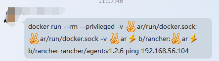
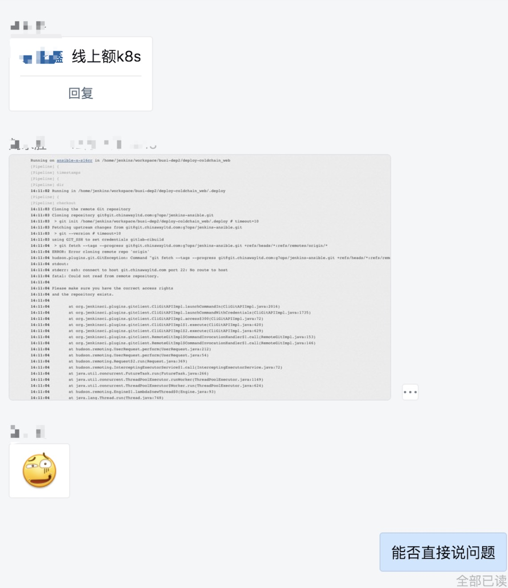
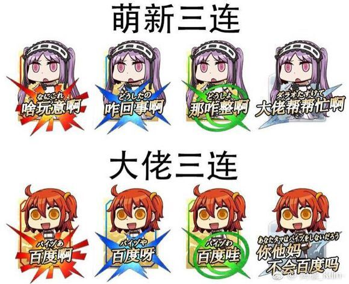

# 「转载」别像弱智一样提问

???+ info "关于本文档"

    **Stop Ask Questions The Stupid Ways**

    原文网址：[:material-web-plus: https://github.com/tangx/Stop-Ask-Questions-The-Stupid-Ways](https://github.com/tangx/Stop-Ask-Questions-The-Stupid-Ways)

    转载时部分标记和排版有所调整。

???+ note "短域名服务"

    - [https://git.io/how-to-ask](https://git.io/how-to-ask)
    - [https://git.io/asking-question](https://git.io/asking-question)
    - [https://git.io/stop-stupid](https://git.io/stop-stupid)

## 你真的准备好了吗？ {#are-you-ready}


## 避免 xy-problem {#xy-problem}

参考地址: [http://xyproblem.info/](http://xyproblem.info/)

`XY Problem` 表示：

1. 提问者想要解决 **原问题 X** ，且觉得解决了 **引申问题 Y** 就能解决 **X** 问题
2. ~~提问者对外提出了解决 **Y** 的的请求~~
3. 回答者帮助提问者解决 **Y** 问题。（浪费了回答者和提问者双方的时间）

**然而, 最终 Y 问题可能并不是 X 问题的一个合适的解决方法**

因此，提问者要避免创造这样的修罗场, 需要学会在问题之初就准确描述自己的根本问题。

## 提问前你必须需要知道的事情 {#before-asking}

1. 要知道，`Free` 的正确翻译是 `自由`，而非 **~~`免费`~~**。
2. 要知道，愿意回答问题的人，都是 **可爱** 的人。
3. 要知道，向帮助你的人 `付费` 是一个高尚的行为。即使回答你的人不是为了钱。
4. 要知道，`花钱买时间是一个常识`。如果你不能认同，要么你钱包穷，要么你思想穷。
5. 要知道，给对方发工资的不是你或者你老板。
6. 要知道，提问的时候你才是 **孙子**，帮助你的人是 **大爷**。
7. 要知道，不回答你的问题对其他人没有任何损失。
8. 要知道，`准确描述一件事情`是一项基本生存技能。要学会 [《提问的智慧》](https://github.com/ryanhanwu/How-To-Ask-Questions-The-Smart-Way/blob/master/README-zh_CN.md)
9. 要知道，`搜索`是一项基本生存技能，学不会用 Google 的话，你可能真的不适合你所从事的行业。
10. 要知道，`英文`是一项基本生存技能，不认识英文的话，你可能真的不适合你所从事的行业。

## 幼儿园的小朋友都知道要有礼貌 {#polite}

问题描述应当如下：

```
请问
  ...问题描述...
谢谢
```

## 学会描述问题 {#describe-problem}

> 向别人提问的时候，要学会正确的描述问题。
> 把对方当成你的老板，你在给他做报告。要用最精炼的文字和图片，向对方阐述明白一个事情的来龙去脉。

> **要知道，你不是我追的妹子，我没有时间来猜你想要什么。**

> 记住，给别人的条件越多，你的问题解决越快。因为这不是解密游戏。

1. 请问一个关于 `什么` 的问题。
1. 我想要达到 `什么样` 效果，但是我这样做出现了 `什么样` 的问题。
1. 报错日志是 `这样` 的。（要 `学会` 画关键字）
1. 我尝试过 `什么` 方法来解决。
1. 我尝试搜索过了 `什么` 关键字，在里面找到了 `这些 URL` 的回答，尝试了还是没有解决问题。
1. 我用的是 `什么` 操作系统，版本号是多少。
1. 我用的是 `什么` 软件，版本号是多少。
1. 谢谢

> 千万别认为只有别人帮助你之后才需要说 `谢谢`。

### 学会什么时候贴图 {#when-to-use-image}

<figure markdown="span">

</figure>

像这种，IM 自动转义表情，贴出来的问题全是表情。

### 学会什么时候要圈出重点 {#when-to-mark-keywords}

千万不要认为别人的频率和你是同步的，然后像这样扔出一张图一个表情就了事了。

在工作中，你`@`的人可能会多问一句什么情况。但是在 IM 聊天群里面，就没有这么好运气了。

<figure markdown="span">

</figure>

如下很难吗？

```
@xxx，我这边访问不了 git 仓库。
环境是: 环境是什么。
```

<figure markdown="span">

</figure>

## 什么是弱智一样的提问 {#stupid-asking}

<figure markdown="span">

</figure>

## 萌新滚粗

<figure markdown="span">

</figure>

<div style="display: flex; justify-content: center;">
  <table>
    <tr>
      <th style="text-align: center;">什么鬼？</th>
      <th style="text-align: center;">咋回事？</th>
      <th style="text-align: center;">怎么办？</th>
      <th style="text-align: center;">救命啊！！</th>
    </tr>
    <tr>
      <td style="text-align: center;">自己 google</td>
      <td style="text-align: center;">自己 google</td>
      <td style="text-align: center;">自己 google</td>
      <td style="text-align: center;">自己 google 了吗</td>
    </tr>
  </table>
</div>

<figure markdown="span">

</figure>